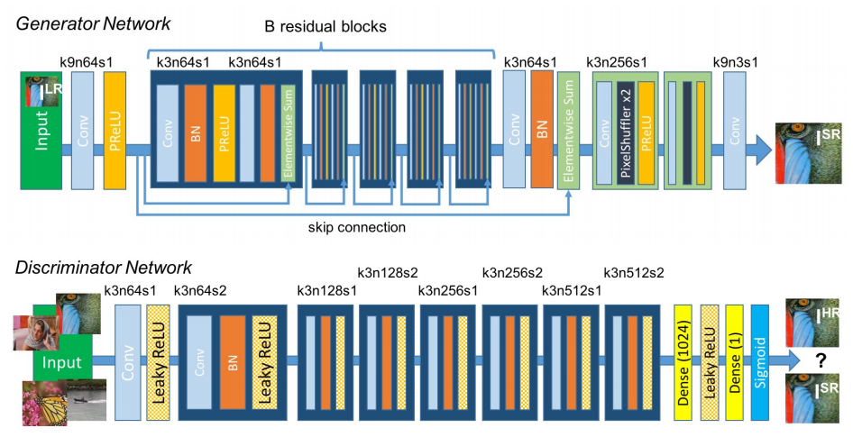

# Implementation of SRGAN (Super-Resolution GAN) 
this repo contains my implementation of the (SRGAN) presented in the paper ([Photo-Realistic Single Image Super-Resolution Using a Generative Adversarial
Network](https://arxiv.org/pdf/1609.04802.pdf)) 

## Authors
Christian Ledig, Lucas Theis, Ferenc Huszar, Jose Caballero, Andrew Cunningham, Alejandro Acosta, Andrew Aitken, Alykhan Tejani, Johannes Totz, Zehan Wang, Wenzhe Shi

## Requirements

* python 3.6
* numpy
* pytorch
* Pillow

## Architecture 



in this implementation i replaced batch-normalisation layer in original architectur with the Instance-Normalisation layer 
and used a smaller patch GAN discriminator.

in the first attempt i used Relu instead of PRelu activation function. then did the same thing as the paper by using PRelu in the second time i used the SRGAN

### Training
since i don't have good hardware to train such a large model (16 residual blocks. I trained for a couple of epochs and it took a long time) 
i used instead a pretrained model [link](https://github.com/dongheehand/SRGAN-PyTorch) to test the SRGAN 

to train this model, place the dataset [DIV2K dataset](https://data.vision.ee.ethz.ch/cvl/DIV2K/) on the data folder named accordingly to the dataset source code, and then run:

```
# code block
python train.py
```

## Results

I tested on some images of Mohamed Ali profile photo, results are shown bellow, the SRGAN architecture is able to create very detailled images 4 times the size of the initial image


the second image


to obtain the same result please use the github : [link](https://github.com/dongheehand/SRGAN-PyTorch) and follow he instructions.

## Generalisation

We can see that the results are very good, but there are some artifacts and deformations in the eyes, this is primarily because of the training data, to generalize to a larger type of images we must train our network with different datasets in different contexts, this will allow a better generalisation and results for hight resolution generation. 


## Videos 

We can use the same architecture to enhance the quality of a video by using a 3D convolution, but a major problem with videos is the temporel dependecie between frames.
one solution is proposed by [Karpathy et al.](https://cs.stanford.edu/people/karpathy/deepvideo/deepvideo_cvpr2014.pdf)
using stacked frames on top of eachothers instead of enhancing one frame at the time, another solution is to use LSTMs (Long Short Term Momory) recurrent neural networks.


# References
* The code for this projet is based on : [link](https://github.com/eriklindernoren/PyTorch-GAN/tree/master/implementations/pix2pix) 

#### papers 

* [Photo-Realistic Single Image Super-Resolution Using a Generative Adversarial Network](https://arxiv.org/pdf/1609.04802.pdf)
* [Residual Dense Network for Image Super-Resolution](https://arxiv.org/abs/1802.08797)
* [ESRGAN: Enhanced Super-Resolution Generative Adversarial Networks](https://arxiv.org/abs/1809.00219)
 
